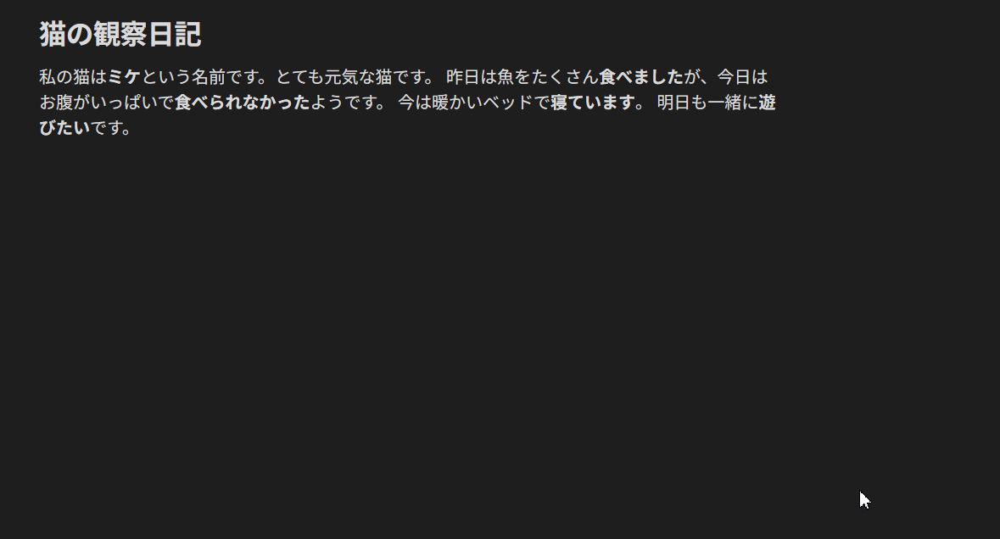

# Obsidian Japanese Popup Dictionary

A fast, offline popup dictionary for Japanese learners using Obsidian.

## Features

- **Instant Lookups:** fast local lookups using IndexedDB.
- **Yomitan/Yomichan Compatible:** Supports Yomitan dictionary formats (JMdict, Jitendex, etc.).
- **Deinflection Support:** Automatically detects conjugated verbs and adjectives (e.g., handles 食べられなかった correctly).

> [!WARNING]
> **Desktop Only:** This plugin relies on Node.js and Electron APIs to handle large dictionary imports. It **will not work** on Obsidian Mobile (iOS/Android).

## Installation

### From Community Plugins

1. Open Obsidian Settings > Community Plugins.
2. Click **Browse** and search for "Japanese Popup Dictionary".
3. Click **Install** and then **Enable**.

### Manual Installation

1. Download the latest release from the [Releases](https://github.com/atacansuder/obsidian-japanese-dictionary/releases) page.
2. Extract the `main.js`, `manifest.json`, and `styles.css` files.
3. Place them in your vault's plugin folder: `.obsidian/plugins/japanese-popup-dictionary/`.
4. Reload Obsidian.

## Setup: Importing a Dictionary

Before the plugin works, you must import a dictionary file. This plugin uses the **Yomitan (formerly Yomichan)** dictionary format.

1.  **Download a Dictionary:**
    - Visit [this links](https://yomitan.wiki/dictionaries/#japanese) and download one of the dictionaries.
    - Recommended: [JMDict](https://github.com/yomidevs/jmdict-yomitan/releases) or [Jitendex](https://github.com/stephenmk/Jitendex/releases).
    - Ensure the file is a `.zip` file (do not unzip it).

2.  **Open Plugin Settings:**
    - Go to **Settings** > **Japanese Popup Dictionary**.

3.  **Import the File:**
    - Click the **Folder Icon** button to open the plugin's data folder on your computer.
    - **Copy/Paste** your downloaded dictionary `.zip` file into this folder. **Make sure that there is only one zip file!**
    - Return to Obsidian and click the **Import .zip** button.
    - Wait for the progress bar to complete.

4.  **Done!** You can now delete the `.zip` file from the folder if you wish.

## Usage

1.  Open a note containing Japanese text.
2.  Hold the **Trigger Key** (Default: `Shift`).
3.  Hover your mouse over a word.
4.  A popup will appear with the definition.

## Settings

- **Trigger Key:** Select which key to hold to activate the scanner (`Shift`, `Ctrl`, `Alt`, or `None`).
    - _Note: Setting this to "None" causes the dictionary to scan every time you move your mouse over Japanese text._
- **Enable/Disable:** Quickly toggle the plugin on or off without uninstalling.

## Deleting Imported Dictionary

Imported dictionaries are stored in Obsidian's internal database (IndexedDB) and consume disk space. Use one of the following methods to remove a dictionary:

- **Delete via Settings:** Go to the plugin settings, click the **Delete dictionary** button, and wait for the deletion to complete.
- **Delete Manually:** If the button fails, you can manually clear the database:
    1. Open Developer Tools (`Ctrl+Shift+I` on Windows, `Cmd⌘+Option+I` on Mac).
    2. Navigate to the **Application** tab.
    3. Expand **IndexedDB** in the sidebar.
    4. Select **yomitan-dict** and click **Delete database**.
    5. Restart Obsidian.

> [!NOTE]
> If the keyboard shortcut doesn't open Developer Tools, go to **Settings** → **Appearance** → **Window frame style** and select **Obsidian frame**. Restart Obsidian, then click the **Obsidian logo** (top-left corner) and select **View** → **Toggle Developer Tools**.

## Development

If you want to contribute or build from source:

1.  Clone the repository.
2.  Run `npm install` to install dependencies.
3.  Run `npm run dev` to start compilation in watch mode.

## Support the Developer

If you find this plugin useful, please consider buying me a coffe.

